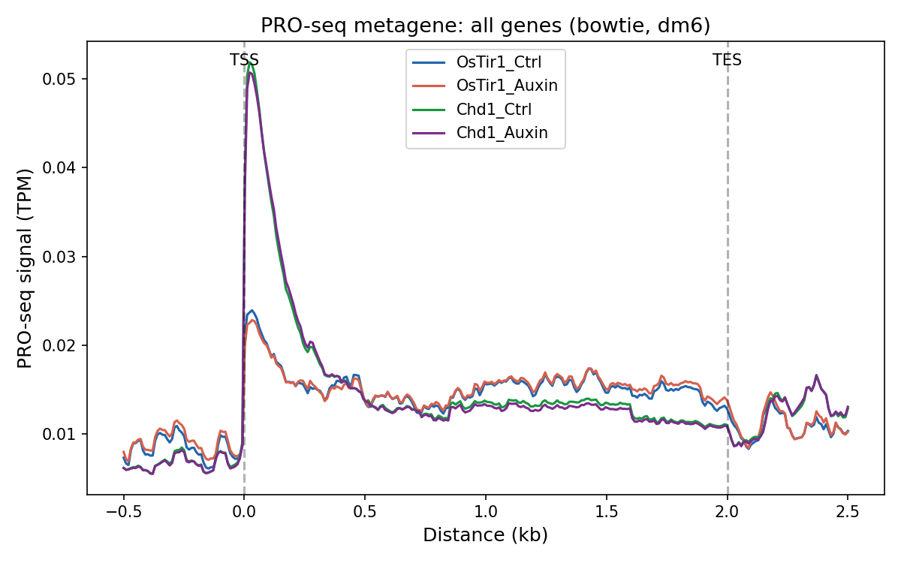
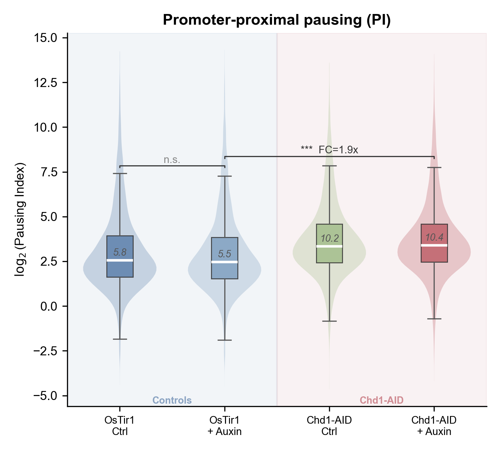
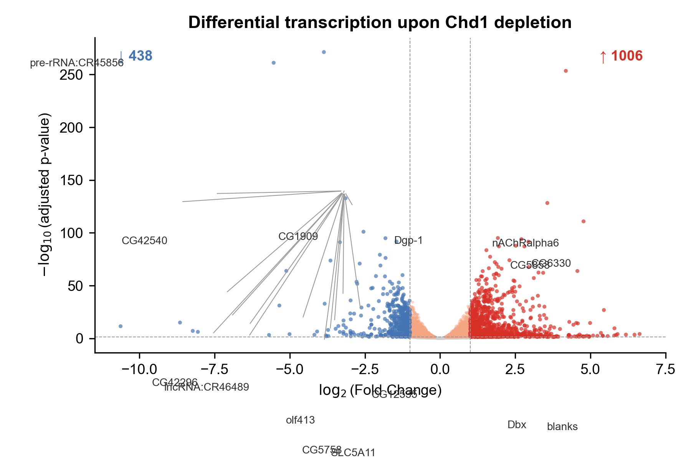
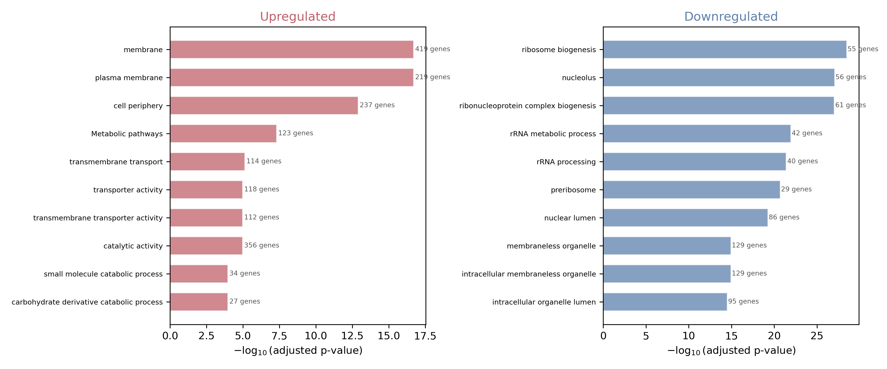
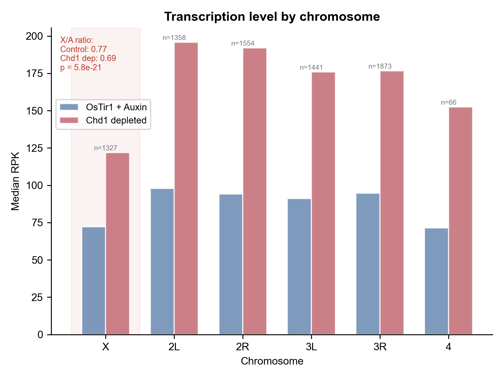

# Role of CHD1 in transcription elongation and aberrant transcription in *Drosophila*

Analysis of PRO-seq data from *Drosophila melanogaster* S2 cells to investigate how chromatin remodeling factor CHD1 affects RNA Polymerase II dynamics, aberrant transcription, and dosage compensation.

`Python` `R` `PRO-seq` `DESeq2` `Chromatin Biology` `Drosophila`

**Data:** Hendy O. et al., 2022 ([doi:10.1093/molbev/msab369](https://doi.org/10.1093/molbev/msab369)) | GEO: [GSE184187](https://www.ncbi.nlm.nih.gov/geo/query/acc.cgi?acc=GSE184187)

## Background

CHD1 is an ATP-dependent chromatin remodeling factor that slides nucleosomes to facilitate transcription elongation [1, 2]. It remodels the +1 nucleosome downstream of the transcription start site (TSS), helping RNA Polymerase II transition from the paused state into productive elongation. CHD1 also reassembles nucleosomes behind the elongating polymerase, preventing cryptic transcription from internal promoters [3].

*Drosophila* S2 cells are of male origin and have a single X chromosome. In males, the MSL complex upregulates X-linked transcription ~2-fold to compensate for having one X instead of two [4, 5]. Since CHD1 facilitates elongation, its loss may also affect dosage compensation efficiency.

## Key findings

- CHD1 depletion causes a **1.9-fold increase** in promoter-proximal pausing (PI: 5.5 → 10.4)
- Antisense transcription in gene bodies **increases 1.7-fold**
- X/A expression ratio **drops from 0.77 to 0.69**, linking CHD1 to dosage compensation
- **Ribosome biogenesis genes** are the most affected targets (GO enrichment)
- Leaky degradation of the AID tag detected across all analyses

## Experimental design

8 PRO-seq samples (4 conditions × 2 biological replicates) with triple control:

| Condition | Genotype | Treatment | Role |
|-----------|----------|-----------|------|
| OsTir1_Ctrl | OsTir1 only | No auxin | Baseline control |
| OsTir1_Auxin | OsTir1 only | + Auxin | Auxin effect control |
| Chd1_Ctrl | Chd1-AID + OsTir1 | No auxin | AID tag effect control |
| Chd1_Auxin | Chd1-AID + OsTir1 | + Auxin | **CHD1 depleted** |

## Repository structure

```
├── README.md
├── environment.yaml
├── scripts/
│   ├── 01_pipeline_preprocessing.sh    # FASTQ → BAM → BigWig
│   ├── 02_annotation.sh                # refGene → BED
│   ├── 03_plot_metagene.py             # Combined metagene profile
│   ├── 04_pausing_index.py             # PI calculation + figures
│   ├── 05_deseq2_analysis.R            # Differential transcription
│   ├── 06_volcano_heatmap.py           # Volcano + heatmap + correlation
│   ├── 07_aberrant_transcription.py    # Antisense transcription
│   ├── 08_dosage_compensation.py       # X/A ratio analysis
│   └── 09_go_enrichment.py             # GO via g:Profiler API
├── figures/                            # All output figures
├── results/                            # DESeq2 tables, GO CSVs
└── annotation/                         # Gene BED files (dm6)
```

## Pipeline overview

### Preprocessing (`01_preprocessing/`)

1. Download FASTQ from SRA (`fasterq-dump`)
2. UMI extraction - 8 nt barcode (`umi_tools extract`)
3. Adapter trimming (`cutadapt`, Illumina Universal Adapter)
4. Alignment to dm6 genome (`bowtie2`, end-to-end, very-sensitive)
5. UMI-based deduplication (`umi_tools dedup`)
6. Strand-specific BigWig generation (`bedtools genomecov` + `bedGraphToBigWig`)
7. Metagene profiles (`deepTools computeMatrix` + `plotProfile`)


### Analysis scripts

| Script | Input | Output | Method |
|--------|-------|--------|--------|
| `03_plot_metagene.py` | deepTools matrix | Metagene profile | Weighted average of +/- strand profiles |
| `04_pausing_index.py` | BAM files | PI per gene, violin+box plots | pysam, Wilcoxon test |
| `05_deseq2_analysis.R` | BAM files | DE genes, PCA, volcano | DESeq2, `~condition` design |
| `06_volcano_heatmap.py` | DESeq2 CSV | Volcano + heatmap + correlation | matplotlib, seaborn |
| `07_aberrant_transcription.py` | BAM files | AS ratio per gene | pysam, sense/antisense counts |
| `08_dosage_compensation.py` | BAM files | X/A ratio, paired barplot | RPK, Mann-Whitney U |
| `09_go_enrichment.py` | DESeq2 CSV | GO dot plots, barplots | g:Profiler REST API |

## Tool versions

| Tool | Version | Key parameters |
|------|---------|---------------|
| bowtie2 | 2.5.x | default (end-to-end, sensitive) |
| cutadapt | 4.x | `-a AGATCGGAAGAGCACACGTCTGAACTCCAGTCA -m 15 -O 10` |
| umi_tools | 1.1.x | `extract --bc-pattern=NNNNNNNN` |
| samtools | 1.x | `sort`, `index` |
| bedtools | 2.31.x | `genomecov -bg` with strand-specific shift |
| deepTools | 3.5.x | `computeMatrix scale-regions --binSize 10` |
| DESeq2 | 1.40.x | `design = ~condition`, Benjamini-Hochberg correction |
| g:Profiler | REST API | `organism = dmelanogaster`, FDR < 0.05 |

## How to reproduce

### Requirements

```bash
conda create -n proseq python=3.10
conda activate proseq
conda install -c bioconda -c conda-forge \
    bowtie2 samtools bedtools deeptools \
    umi_tools cutadapt sra-tools fastqc
pip install pysam pandas numpy matplotlib scipy seaborn requests
```

For DESeq2 (R):
```r
BiocManager::install(c("DESeq2", "GenomicAlignments", "Rsamtools"))
install.packages(c("ggplot2", "pheatmap"))
```

### Run

```bash
# preprocessing (requires ~50 GB disk, ~4 hours)
bash scripts/01_pipeline_preprocessing.sh
bash scripts/02_prepare_annotation.sh

# analysis (requires BAM files from preprocessing)
python scripts/03_plot_metagene.py
python scripts/04_pausing_index.py
Rscript scripts/05_deseq2_analysis.R
python scripts/06_volcano_heatmap.py
python scripts/07_aberrant_transcription.py
python scripts/08_dosage_compensation.py
python scripts/09_go_enrichment.py
```

## Selected figures

| Metagene | Pausing Index |
|----------|--------------|
|  |  |

| Volcano | GO enrichment |
|---------|--------------|
|  |  |

| Aberrant transcription | Dosage compensation |
|----------------------|-------------------|
|  |  |

## References

1. Lusser, A., Urwin, D. L., & Kadonaga, J. T. (2005). Distinct activities of CHD1 and ACF in ATP-dependent chromatin assembly. *Nature Structural & Molecular Biology*, 12(2), 160–166. [doi:10.1038/nsmb884](https://doi.org/10.1038/nsmb884)
2. Konev, A. Y., Tribus, M., Park, S. Y., Podhraski, V., Lim, C. Y., Emelyanov, A. V., Vershilova, E., Pirrotta, V., Kadonaga, J. T., Lusser, A., & Fyodorov, D. V. (2007). CHD1 motor protein is required for deposition of histone variant H3.3 into chromatin in vivo. *Science*, 317(5841), 1087–1090. [doi:10.1126/science.1145339](https://doi.org/10.1126/science.1145339)
3. Ferrari, F., Plachetka, A., Alekseyenko, A. A., et al. (2013). "Jump start and gain" model for dosage compensation in Drosophila based on direct sequencing of nascent transcripts. Cell Reports, 5(3), 629–636. [doi:10.1016/j.molcel.2014.09.004](https://pmc.ncbi.nlm.nih.gov/articles/PMC3852897/)
4. Shevelyov, Y. Y., Ulianov, S. V., Gelfand, M. S., Belyakin, S. N., & Razin, S. V. (2022). Dosage compensation in Drosophila: its canonical and non-canonical mechanisms. *International Journal of Molecular Sciences*, 23(18), 10976. [doi:10.3390/ijms231810976](https://doi.org/10.3390/ijms231810976)
5. Larschan, E., Bishop, E. P., Kharchenko, P. V., Core, L. J., Lis, J. T., Park, P. J., & Kuroda, M. I. (2011). X chromosome dosage compensation via enhanced transcriptional elongation in Drosophila. *Nature*, 471(7336), 115–118. [doi:10.1038/nature09757](https://doi.org/10.1038/nature09757)
6. Konev, A. Y., Tiutiunnik, A. A., & Baranovskaya, I. L. (2016). The influence of the Chd1 chromatin assembly and remodeling factor mutations on Drosophila polytene chromosome organization. *Tsitologiya*, 58(4), 281–284.
7. Hendy, O., Serebreni, L., Bergauer, K., Muhar, M., Vos, S. M., Cramer, P., & Stark, A. (2022). Differential context-dependent impact of individual core promoter elements on transcriptional dynamics. *Molecular Biology and Evolution*, 39(1), msab369. [doi:10.1091/mbc.e17-06-0408](https://doi.org/10.1091/mbc.e17-06-0408)
8. Kwak, H., Fuda, N. J., Core, L. J., & Lis, J. T. (2013). Precise maps of RNA polymerase reveal how promoters direct initiation and pausing. *Science*, 339(6122), 950–953. [doi:10.1126/science.1229386](https://doi.org/10.1126/science.1229386)
9. Love, M. I., Huber, W., & Anders, S. (2014). Moderated estimation of fold change and dispersion for RNA-seq data with DESeq2. *Genome Biology*, 15(12), 550. [doi:10.1186/s13059-014-0550-8](https://doi.org/10.1186/s13059-014-0550-8)
10. Clapier, C. R., & Cairns, B. R. (2009). The biology of chromatin remodeling complexes. *Annual Review of Biochemistry*, 78, 273–304. [doi:10.1146/annurev.biochem.77.062706.153223](https://doi.org/10.1146/annurev.biochem.77.062706.153223)
11. Yesbolatova, A., Saito, Y., Kitamoto, N., et al. (2020). The auxin-inducible degron 2 technology provides sharp degradation control. *Nature Communications*, 11(1), 5701. [doi:10.1038/s41467-020-19532-z](https://doi.org/10.1038/s41467-020-19532-z)
12. Raudvere, U., Kolberg, L., Kuzmin, I., et al. (2019). g:Profiler: a web server for functional enrichment analysis. *Nucleic Acids Research*, 47(W1), W191–W198. [doi:10.1093/nar/gkz369](https://doi.org/10.1093/nar/gkz369)

## Contact

Vitalina Khismatulina — Bioinformatics Institute, 2026 (vita84khismatulina@gmail.com)
